# Pipelines — Visual Diagrams (Mermaid)

Companion to `docs/architecture.md`. All 12 pipelines as Mermaid `flowchart` diagrams. These diagrams are the canonical reference for the Developer agent; implementation must match the flows.

---

## 1. Authentication pipeline

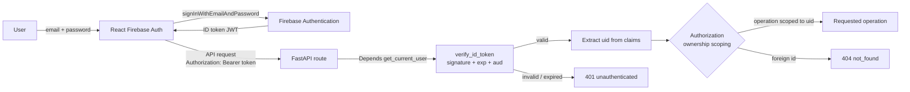

## 2. Journal pipeline

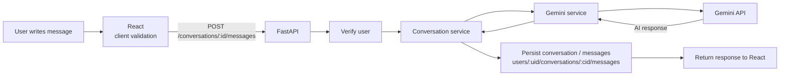

## 3. Multi-turn conversation pipeline

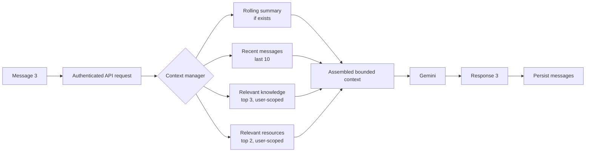

## 4. Summary pipeline

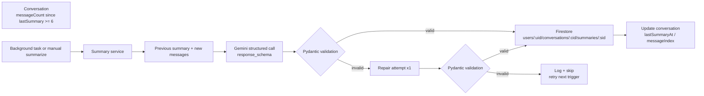

## 5. Resource pipeline

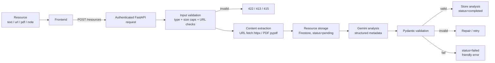

## 6. Knowledge pipeline

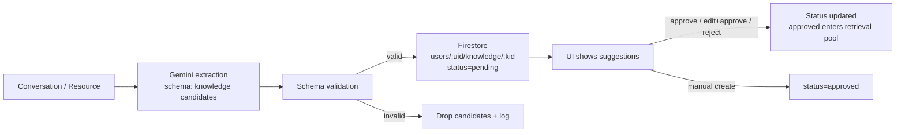

## 7. Recommendation pipeline (optional)

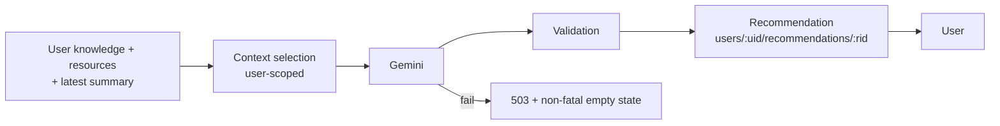

## 8. Voice pipeline (optional, post-MVP)

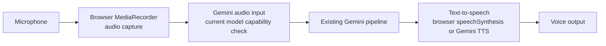

## 9. Secrets pipeline

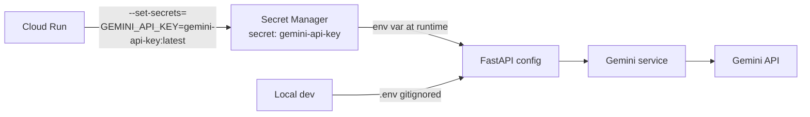

## 10. Deployment pipeline

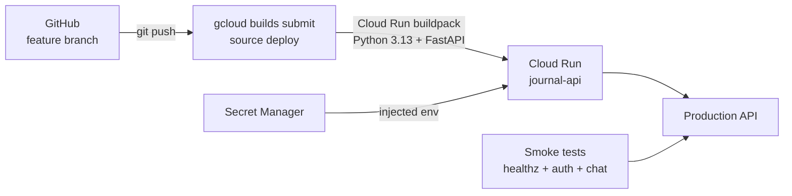

## 11. AI context pipeline

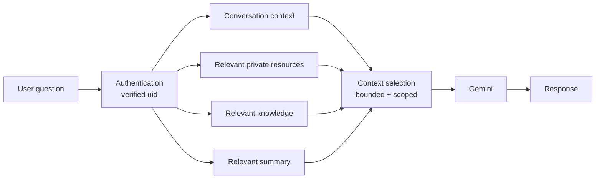

## 12. Progress pipeline (future)

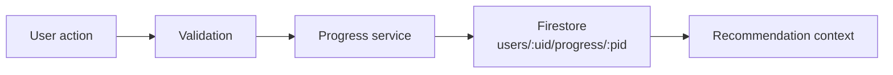
